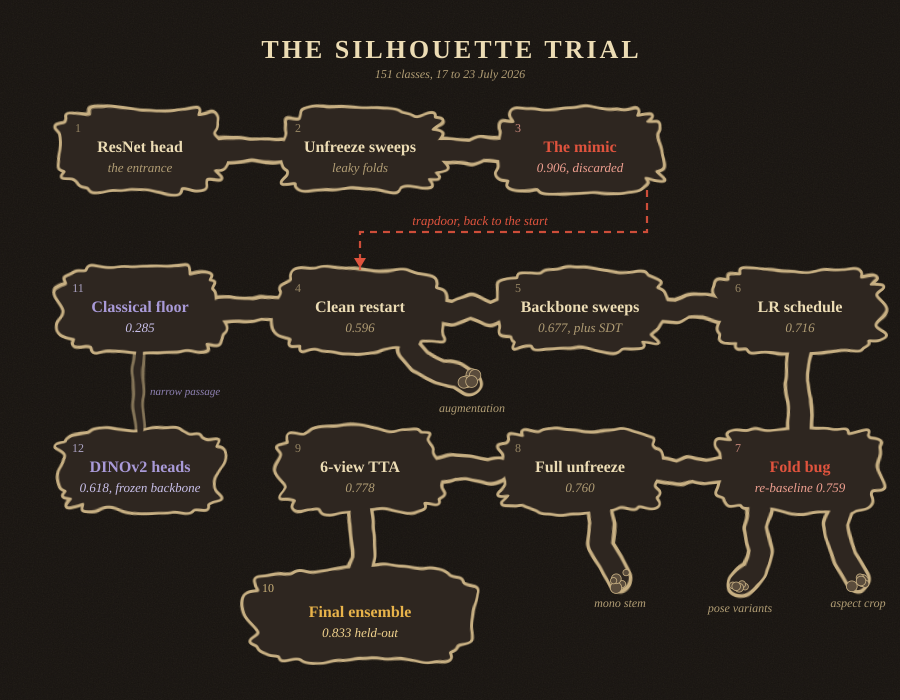

Looking for machine learning working-student and research-assistant roles from October 2026.

## The silhouette trial

Classifying Pokémon silhouettes into 151 classes with transfer learning, in PyTorch with MLflow tracking.
Each room is a checkpoint, and each link opens [the repository](https://github.com/bolkareren/pokemon-training) exactly as it was at that point.

1. **ResNet head** · [`c51d126`](https://github.com/bolkareren/pokemon-training/tree/c51d126) 
   The full pipeline: scraping, silhouette preprocessing, and a pretrained ResNet-50 with a new classification head.
2. **Unfreeze sweeps** · [`5f4fb75`](https://github.com/bolkareren/pokemon-training/tree/5f4fb75) 
   Unfroze progressively more layers and settled on ResNet-50 with shape-biased weights. Every score in this room was measured on leaky folds.
3. **The mimic, 0.906** · [`b3e4765`](https://github.com/bolkareren/pokemon-training/tree/b3e4765) 
   Shiny sprites are recolours, so their silhouettes are pixel-identical to the normal ones. About 62% of every validation fold had a twin in training, and the 0.906 was memorisation. The duplicates were removed and scoring moved to grouped K-fold.
4. **Clean restart, 0.596** · [`524c9b7`](https://github.com/bolkareren/pokemon-training/tree/524c9b7) 
   Everything re-measured on deduplicated data. The leaky results were moved to a separate log so none of them would be reused. The dead end off this room is [augmentation](https://github.com/bolkareren/pokemon-training/tree/1767ebe), which did not help, and elastic warping made it worse.
5. **Backbone sweeps, 0.677** · [`1f01d46`](https://github.com/bolkareren/pokemon-training/tree/1f01d46) 
   Compared ResNet-18, 34 and 50. Size was not the lever. Swapping the shape-biased checkpoint for standard ImageNet weights was (0.653), and a signed-distance-transform input channel added the rest.
6. **LR schedule, 0.716** · [`a31a937`](https://github.com/bolkareren/pokemon-training/tree/a31a937) 
   Cosine schedule with warmup and best-epoch restoration.
7. **Fold bug, 0.759** · [`77acc79`](https://github.com/bolkareren/pokemon-training/tree/77acc79) 
   A mask-polarity bug in the duplicate grouping had left the folds slightly distorted. Grouping shiny sprites by index fixed it, and the same configuration re-measured at 0.759. The two dead ends off this room are [pose variants](https://github.com/bolkareren/pokemon-training/tree/07056e0) and an [aspect-preserving crop](https://github.com/bolkareren/pokemon-training/tree/c8f3d9d), the first things tested on the corrected folds. Neither gave a gain that held up across seeds.
8. **Full unfreeze, 0.760** · [`c68f3af`](https://github.com/bolkareren/pokemon-training/tree/c68f3af) 
   Training the whole backbone, which only became stable once warmup was in place. +1.68 points over three seeds (p = 0.003). The dead end off this room is a [single-channel stem](https://github.com/bolkareren/pokemon-training/tree/dd262ce), testing whether the now-trainable stem could replace the handmade input channels. It could not, and scored worse.
9. **6-view TTA, 0.778** · [`3e14458`](https://github.com/bolkareren/pokemon-training/tree/3e14458) 
   Test-time augmentation over six views, +1.38 points (p = 0.0001).
10. **Final ensemble, 0.833** · [`1ad7316`](https://github.com/bolkareren/pokemon-training/tree/1ad7316) 
    15 models (3 seeds by 5 folds), evaluated once on 197 held-out images that were never trained on. 0.833 top-1 and 0.944 top-5, 95% CI [0.774, 0.878].
11. **Classical floor, 0.285** · [`dfc280f`](https://github.com/bolkareren/pokemon-training/tree/dfc280f) 
    Elliptic Fourier descriptors and Hu moments with shallow classifiers, as a floor for what shape alone gives.
12. **DINOv2 heads, 0.618** · [`7b15283`](https://github.com/bolkareren/pokemon-training/tree/7b15283) 
    Frozen DINOv2 features with shallow classifiers (logistic regression, RBF SVM, random forest). Logistic regression was best, and the choice of head moved the score by about 15 points.

## Other projects

- **LLM-guided AutoML for relational tabular data** · [Carlosing/mle-star-mcts-skrub](https://github.com/Carlosing/mle-star-mcts-skrub) 
  Built on MLE-STAR, an LLM-agent AutoML system, and reworked much of it around MCTS search over skrub pipelines and relational feature engineering. Benchmarked against AutoGluon and the original MLE-STAR, with deterministic replay and a 427-test suite.
- **Shape registration under topological changes** · Berlin University Alliance (StuROP) 
  Registering a 3D template to 2D image points with perspective-n-point solvers, extended to templates that tear (SDP-based F-PnP). Designed the sampling algorithm that finds the components, and ran the experiments to find heuristics for component separation, from synthetic data to real torn-paper photographs.
- **Co-evolutionary opinion and infection dynamics** · [jschlieffen/Numerics_4_project](https://github.com/jschlieffen/Numerics_4_project) 
  A ~120k-agent SIR model coupled with opinion dynamics, fit to COVID case and survey data with differential evolution.
